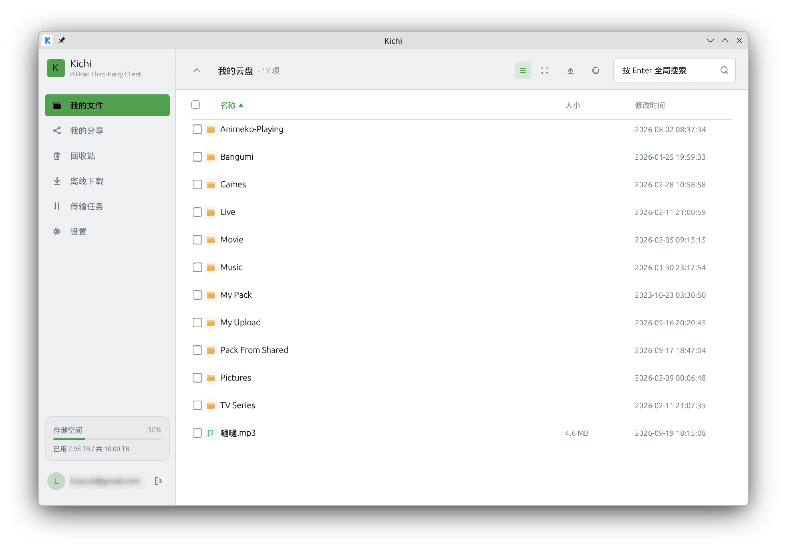

<div align="center">

# Kichi — PikPak Linux 客户端

<p>
  <a href="https://www.rust-lang.org/"></a>
  <a href="https://github.com/emilk/egui"></a>
  <a href="https://github.com/lyndon0na/kichi#构建与运行"></a>
  <a href="https://github.com/lyndon0na/kichi/releases"></a>
  <a href="https://github.com/lyndon0na/kichi/actions/workflows/ci.yml"></a>
  <a href="https://github.com/lyndon0na/kichi/actions/workflows/release.yml"></a>
  <a href="https://github.com/lyndon0na/kichi/blob/master/LICENSE"></a>
  <a href="https://github.com/lyndon0na/kichi#免责声明"></a>
</p>

基于逆向私有 API 的 PikPak 云盘 Linux 桌面客户端 · Rust + egui · 单一二进制

</div>

> [!WARNING]
> **非官方项目。** 本项目与 PikPak / 迅雷及其关联公司无关。接口与签名算法来自社区逆向成果，可能随服务端变更而失效，仅供学习与个人使用。

## 目录

- [界面](#界面)
- [功能](#功能)
- [架构](#架构)
- [目录结构](#目录结构)
- [构建与运行](#构建与运行)
- [配置与数据](#配置与数据)
- [已知限制](#已知限制)
- [免责声明](#免责声明)

## 界面

<p align="center">
  
</p>

桌面 GUI 采用「左侧边栏 + 右侧内容区」布局：

| 区域 | 内容 |
| --- | --- |
| 侧边栏 | 我的文件 / 我的分享 / 回收站 / 离线下载 / 传输任务 / 设置；底部常驻账户与存储空间配额卡 |
| 文件页 | 类型矢量图标、网格视图真实缩略图、可点击排序表头（名称 / 大小 / 修改时间）、可拖拽列宽、列表 / 网格双视图（Ctrl+滚轮缩放）、当前目录名称过滤 |
| 传输任务 | 上传 / 下载分栏；下载页带状态筛选、批量选择与图标操作（目录聚合为单张卡片，可展开为目录树，卡片显示「文件 已完成/全部」），上传页带进度 / 取消 / 重试 |
| 主题 | 读取系统 KDE 配色跟随明暗与强调色，非 KDE 回退内置浅色；统一圆角与配色参数 |

> [!NOTE]
> 文件行操作以右键菜单为主（下载 / 播放 / 重命名 / 复制 / 剪切 / 粘贴到此处 / 移入回收站）；双击文件夹进入、双击文件预览；单击选中（`Ctrl` 多选 / `Shift` 范围选择）。

## 功能

| 模块 | 能力 |
| :-- | :-- |
| 登录 / 账户 | 邮箱 / 手机号密码登录（captcha 流程）、会话持久化与自动续期、密钥环记住密码 |
| 文件管理 | 目录浏览（面包屑）、排序、过滤、列表 / 网格双视图（网格支持真实缩略图与 Ctrl+滚轮缩放）、复制 / 剪切 / 粘贴、新建 / 重命名 |
| 本地上传 | gcid 秒传 + 阿里云 OSS 分片（并发、断点续传）、目录递归、历史持久化 |
| 本地下载 | `.part` + Range 断点续传、原子改名、完整性校验、退避重试、历史持久化；整目录递归下载 |
| 推送到 aria2 | 文件 / 目录一键交给外部下载器（aria2 / Motrix）：解析限时直链推给 RPC 下载；设置页配置地址 / 密钥 / 下载目录，可「测试连接」 |
| 离线下载 | 磁力 / 直链转存、状态页签 + 自适应轮询、分页「加载更多」、多选批量（重试 / 删除）、保存位置可选 |
| 分享 | 创建与管理分享链接；转存他人分享到自己网盘 |
| 回收站 | 列出 / 还原 / 彻底删除 / 一键清空，SWR 缓存 |
| 文件预览 | 音视频 `mpv` 流式播放（清晰度选择 + 外挂字幕）、其它类型系统查看器回退（下载带进度 / 可取消）；压缩包等类型只提供下载入口 |
| 体验 | KDE 主题跟随、中文界面与 CJK 字体、任务角标 |

<details>
<summary><b>文件浏览与管理 · 详细功能</b></summary>

- 目录浏览（面包屑导航、进入 / 返回），带目录缓存（SWR）与分页加载
- 列表 / 图标（网格）视图切换；表头排序（名称 / 大小 / 修改时间，升 / 降序）与列宽拖拽
- 当前目录按名称过滤
- 新建文件夹、重命名、多选 / 批量移入回收站（回收后本地即时移除，不依赖服务端同步）
- 复制 / 剪切后再到目标目录粘贴（移动 / 复制到目标目录）
- 右键菜单、快捷键（`F5` 刷新 / `Ctrl+A` 全选 / `Delete` 删除 / `Ctrl+C/X/V` / `Esc` 取消）
- 文件类型矢量图标（文件夹 / 视频 / 图片 / 音频 / 文档 / 压缩包）；网格视图加载真实缩略图（磁盘缓存，Ctrl + 滚轮缩放网格大小）

</details>

<details>
<summary><b>本地上传 · 详细功能</b></summary>

- 入口：文件页工具栏「上传文件 / 上传文件夹」、空白右键菜单，或「传输任务 ▸ 上传」上传到当前目录
- 先算 gcid 秒传哈希：服务端已有相同内容时直接完成（秒传），否则走阿里云 OSS 分片上传
- 分片走 OSS HMAC-SHA1（不引入 AWS SDK），**并发上传**且网络中断后**续传已传分片**；进度 / 速率、取消、失败重试
- 目录递归上传：按本地目录结构在云端建目录并逐个上传（跳过符号链接）
- 上传列表：目标网盘路径、速率 / 剩余时间、完成时间；状态筛选（全部 / 进行中 / 已完成 / 失败）、全选与批量取消 / 重试 / 移除、清除已完成；完成后可「在网盘中打开」
- 上传历史持久化（`uploads.json`，最多 200 条，重启后恢复列表）

</details>

<details>
<summary><b>本地下载 · 详细功能</b></summary>

- 入口：文件页选中 / 右键、离线「已完成」任务均可一键下载到本地目录
- 整目录递归下载：选中文件夹（工具栏多选或右键「下载到本地…」）后按云端层级在本地建同名目录
- 「传输任务」页把整目录聚合为一张卡片（显示「文件 已完成/全部」与合计大小 / 速率），展开后按层级显示子目录与文件：子目录行可单独折叠并显示其子树文件进度，文件行缩进显示各自进度
- 「传输任务」页下载分栏展示任务列表（进度 / 速率 / 取消 / 打开目录），带状态筛选与批量选择、批量重试 / 移除；目录任务的取消 / 重试 / 移除作用于整个目录（重试仅重下失败子文件）
- `.part` 临时文件 + 完成后原子改名；中断后自动 `Range` 断点续传
- 完成后按云端声明大小做完整性校验，不完整不会落盘为正式文件
- 解析直链 / 传输的瞬时错误（断网、5xx、429 等）均退避重试（重试前自动刷新限时直链）
- 同名文件自动加 ` (n)`，目标目录记忆、下载历史持久化（最多 200 条，重启后恢复）
- 也可交给外部下载器：文件 / 目录右键或选中后「发送到 aria2」，解析限时直链推给 aria2（或 Motrix）自行下载；整目录推送保留云端层级（在设置页启用并配置 RPC 地址，可「测试连接」）

</details>

<details>
<summary><b>离线下载 / 分享 / 回收站 · 详细功能</b></summary>

**离线下载（磁力 / HTTP）**
- 提交 magnet / 直链转存到云端
- 状态页签：等待 / 下载中 / 已完成 / 失败（带计数；轮询节拍随是否有进行中任务自适应）
- 定高卡片列表 + 虚拟滚动；长文件名按宽度截断、hover 显示全名，操作为图标按钮（下载 / 重试 / 删除）
- 支持多选与批量操作（重试选中 / 删除选中，`Ctrl` / `Shift` 多选与全选）
- 每个状态超过 100 条时支持「加载更多」分页；手动刷新与自动轮询都会保持已加载页数
- 保存位置可选；提交表单常驻页面顶部

**分享**
- 文件页工具栏 / 右键对选中项（含文件夹）创建分享链接，可选有效期（1 / 7 / 30 天或永久）与提取码
- 「我的分享」页列出已创建的分享（公开 / 私密 / 已失效、文件数、有效期、浏览 / 转存次数、创建时间）
- 复制分享链接 / 链接 + 提取码；单条取消或勾选批量取消（链接立即失效）；在浏览器打开；分页加载
- 创建成功后弹窗展示链接与提取码，一键复制 / 在浏览器打开；分享列表 SWR 缓存
- 「转存分享」：在「我的分享」页点击「转存分享」，输入他人分享链接（或 ID）与提取码，解析后选择文件转存到自己网盘（可指定目标目录）

**回收站**
- 「我的文件」中删除的文件 / 文件夹在此列出（类型图标、大小、删除时间），分页加载、SWR 缓存
- 单行或勾选批量「还原」到原目录，或「彻底删除」（二次确认，不可恢复）
- 右上「清空回收站」：调用服务端接口一次清空全部内容
- 操作成功后即时从列表移除，并刷新存储配额与目录缓存

</details>

<details>
<summary><b>文件预览 / 界面与体验 · 详细功能</b></summary>

**文件预览**
- 按类型给入口：音视频 / 图片 / PDF / Office / 文本 / 字幕等可「打开」，压缩包 / 镜像 / 可执行 / 种子只提供「下载到本地」（双击这类文件时提示改用下载）
- 双击或右键「播放 ▸ 原画」：音 / 视频交给 `mpv` 流式播放（携带签名直链所需请求头，无需完整下载）
- 视频右键「播放 ▸」子菜单列出云端可用清晰度（原画 / 1080P / 720P…），选择后由 `mpv` 播放；无转码流时仅原画
- 音频只有原文件，直接播放（不解析清晰度）
- 自动挂载同目录同集外挂字幕（`.ass` / `.srt` / `.vtt` 等），优先中文字幕
- 其它文件下载到本地缓存后交给系统默认查看器，同一文件再次预览直接命中缓存；超过 64 MiB 且未命中缓存时先弹确认，下载期间右下角显示进度条并可随时取消
- 系统没有关联程序时提示「系统未关联打开「x」的程序」，不再出现「已打开」的假成功
- 未安装 `mpv` 时仅提示安装，不静默回退
- 点击预览后的等待提示常驻右下角，直到 `mpv` 播放窗口 / 系统查看器真正打开（或判定失败）才被结果提示替换，解析 / 准备较慢时不再出现「点了没反应」；`mpv` 在窗口出现前退出（坏直链 / 断网）时提示「mpv 已退出，未能播放」，不再假成功

**界面与体验**
- 左侧边栏导航（我的文件 / 我的分享 / 回收站 / 离线下载 / 传输任务 / 设置）
- 自动跟随系统 KDE 主题与强调色、记住账号
- 侧边栏底部容量进度卡、任务角标、中文界面与 CJK 字体自动加载
- 网格视图加载真实缩略图（磁盘缓存），Ctrl + 滚轮缩放网格大小，图标 / 文字 / 缩略图随卡片等比缩放

</details>

## 架构

界面与网络严格隔离：UI 在 egui 主线程，所有网络与磁盘 I/O 在独立 tokio worker 线程，两者通过 `mpsc` 交换 `Cmd` / `Msg`。

```text
        ┌──────────────────────────────────────────┐
        │                kichi-gui                  │
        │   egui / eframe UI（主线程）               │
        │   App · Pages · Dialogs · theme/icons     │
        └────────────────────┬─────────────────────┘
                    Cmd  ▲    │    ▼  Msg
                         │  mpsc channel
        ┌────────────────────┴─────────────────────┐
        │          tokio worker（后台线程）          │
        │   登录 · 文件 · 离线任务 · 上传 · 下载      │
        │   预览 · 分享转存 · 会话续期               │
        └────────────────────┬─────────────────────┘
                             │ HTTPS
        ┌────────────────────┴─────────────────────┐
        │               kichi-core                  │
        │  client（自动 refresh / captcha 重试）      │
        │  captcha · session · download · upload     │
        └───────────┬───────────────────┬──────────┘
                    │                   │
            ┌───────┴──────┐   ┌────────┴────────┐
            │  PikPak API  │   │   Aliyun OSS    │
            │  （业务数据） │   │  （分片上传）    │
            └──────────────┘   └─────────────────┘
```

## 目录结构

<details>
<summary>展开完整目录树</summary>

```text
crates/
├── kichi-core/                  # API 客户端核心库（无界面依赖，可复用）
│   └── src/
│       ├── lib.rs               # crate 根：模块声明与公开导出
│       ├── client.rs            # HTTP 层：鉴权、自动 refresh(code16)、自动 captcha 重试(code9)
│       ├── captcha.rs           # captcha_sign / device_sign 加签算法
│       ├── consts.rs            # client_id / host / 盐值表 / 常量
│       ├── download.rs          # 直链解析、.part 断点续传、完整性校验
│       ├── aria2.rs             # aria2 JSON-RPC 客户端（推送到外部下载器：version / addUri / getGlobalOption）
│       ├── upload.rs            # gcid 秒传哈希、阿里云 OSS 分片签名与上传
│       ├── types.rs             # File / Quota / Task / Share 等模型（防御式解析）
│       ├── error.rs             # 统一错误类型
│       └── session.rs           # 会话持久化
└── kichi-gui/                   # eframe(egui) 桌面应用
    └── src/
        ├── main.rs              # 入口
        ├── logging.rs           # 日志初始化（stderr + ~/.cache/kichi/kichi.log，按大小轮转）
        ├── cache.rs             # 磁盘缓存淘汰（预览 / 缩略图共用的 mtime-LRU + 双上限）
        ├── filetypes.rs         # 文件类型分类与预览路由（mime + 扩展名单点维护）
        ├── app/                 # UI 模块（按职责拆分）
        │   ├── mod.rs             # App 结构体、初始化、消息收敛与跨域编排（各域状态在域文件里）
        │   ├── global.rs          # 全局句柄（命令通道 / 提示条 / 系统配色）+ 共享类型 Page / CacheUsage
        │   ├── login.rs           # 登录页
        │   ├── sidebar.rs         # 侧边栏 + 导航 + 账户 / 配额卡片
        │   ├── files/             # 文件浏览页（渲染与跨域动作分离）
        │   │   ├── mod.rs         # FilesPage：导航栈 / 目录缓存 / 选中集 / 排序过滤 + 渲染入口 show + 文件域类型
        │   │   ├── list.rs        # 列表视图（列宽布局 / 表头 / 行集合）
        │   │   ├── grid.rs        # 网格视图（卡片绘制 + 缩略图预取行区间）
        │   │   ├── row.rs         # 列表行与右键菜单项
        │   │   └── toolbar.rs     # 顶部栏（面包屑 / 搜索框 / 视图切换 / 操作区）
        │   ├── tasks/             # 离线任务页（渲染与跨域动作分离）
        │   │   ├── mod.rs         # TasksPage：任务分桶 / 分页 / 选择 / 新建表单 + 生命周期 + 任务域类型
        │   │   ├── list.rs        # 页壳 / 阶段页签 / 批量操作条 / 任务列表 + 加载更多
        │   │   ├── card.rs        # 单张任务卡片
        │   │   └── picker.rs      # 「保存到」网盘目录选择器
        │   ├── transfers/         # 传输任务页（渲染与跨域动作分离）
        │   │   ├── mod.rs         # TransfersPage：任务表 / 选中集 / 筛选 + 生命周期 + 渲染入口 show + 共享类型
        │   │   ├── download.rs    # 下载分栏（任务卡片 / 目录树 / 底部批量操作条）+ 下载域类型
        │   │   ├── upload.rs      # 上传分栏（任务卡片 / 底部批量操作条）+ 上传域类型
        │   │   └── model.rs       # 传输纯逻辑（状态映射 / 进度聚合 / 目录树计数 / 速率取样）
        │   ├── settings_page.rs   # 设置页
        │   ├── shares/            # 分享域（状态与消息处理 + 渲染按角色分文件）
        │   │   ├── mod.rs         # SharesPage：状态 / 生命周期 / 消息处理 + ShareResult
        │   │   ├── mine.rs        # 我的分享列表 + 创建分享 / 结果 / 取消确认弹窗
        │   │   └── restore.rs     # 转存分享（解析 / 浏览 / 目标目录选择器 / 保存与移动重试）
        │   ├── trash.rs           # 回收站域（列表 / 还原 / 彻底删除）
        │   ├── preview.rs         # 预览域（下载进度 / 取消 / 清晰度切换 / 外部打开探针）+ 预览域类型
        │   ├── search.rs          # 全局搜索域（关键字 / 结果分页）
        │   ├── thumbs.rs          # 缩略图域（GPU 纹理 LRU + 在途 / 失败登记）
        │   ├── dialogs.rs         # 通用弹窗：新建 / 重命名 / 移入回收站 / 退出登录 + 提示条
        │   └── helpers.rs         # 工具函数（字体、目录选择、mpv 播放、文本裁剪等）
        ├── icons.rs             # 矢量图标库（painter 绘制，不依赖字体字形）
        ├── theme.rs             # 配色 / 圆角 / 间距参数与全局样式
        ├── kde.rs               # 读取 KDE 系统配色（kdeglobals），非 KDE 返回 None
        ├── worker/              # 后台 tokio 线程，按域拆分
        │   ├── mod.rs           # 命令循环 handle（45 个 Cmd 分支各一行转调）+ 跨域辅助
        │   ├── download.rs      # 下载管线（断点续传 / 退避重试 / 取消登记）
        │   ├── upload.rs        # 上传管线（gcid 秒传 + 阿里云 OSS 分片）
        │   ├── aria2.rs         # aria2 推送（扫描目录 / 解析直链 → addUri，独立小闸）
        │   ├── preview.rs       # 预览：媒体走 mpv 流播，其余下载到缓存
        │   ├── thumbs.rs        # 缩略图下载 / 解码 / 磁盘缓存
        │   ├── files.rs         # 文件列表 / 搜索 / 新建 / 重命名 / 移动 / 复制
        │   ├── tasks.rs         # 离线任务
        │   ├── shares.rs        # 分享与转存
        │   ├── trash.rs         # 回收站
        │   ├── auth.rs          # 登录 / 会话恢复 / 密钥环
        │   ├── gate.rs          # 动态并发闸（并发设置即时生效）
        │   └── cache.rs         # 磁盘缓存淘汰（预览 / 缩略图共用）
        ├── credentials.rs       # 系统密钥环读写账号密码（Secret Service）
        ├── msg.rs               # 前后台消息协议
        ├── settings.rs          # 设置（下载目录 / 传输并发 / aria2）与下载 / 上传历史持久化
        └── format.rs            # 大小 / 时间 / 状态文案格式化

packaging/                       # 发行包
├── kichi.desktop                # 桌面入口（AppImage / Flatpak 共用）
├── appimage/                    # AppImage 出包
│   ├── build-appimage.sh        # 组装 AppDir + appimagetool
│   └── AppRun                   # AppImage 入口脚本
└── flatpak/                     # Flatpak 出包
    ├── build-flatpak.sh         # flatpak-builder + build-bundle
    └── io.github.lyndon0na.Kichi.yml   # Flatpak 清单（沙箱内源码构建）

.github/workflows/
├── ci.yml                       # push master / PR 触发: fmt + clippy + test
└── release.yml                  # 推 v* tag 自动打包 AppImage / Flatpak 并发 Release

docs/                            # 项目文档
├── PROJECT_PLAN.md              # 里程碑（M0–M24）与实现笔记
├── TODO.md                      # 待办与改进队列（唯一队列）
├── UI_STYLE.md                  # 界面风格规范（KDE / Breeze）
├── UPLOAD_RESUME_NOTES.md       # 上传跨重启续传复盘（协议限制，不可行）
└── VIBE_CODING_NOTES.md         # 工程结构评审与协作笔记（本地文件）
```

</details>

## 构建与运行

环境：Linux（已在 Fedora 44 / KDE Plasma / Wayland 验证）。

### 1. 系统依赖

```bash
# Fedora / RHEL 系
sudo dnf install gcc pkgconf openssl-devel libxkbcommon-devel wayland-devel \
     mesa-libGL mesa-libEGL fontconfig
```

> [!IMPORTANT]
> 需要一款含中文字体的 TTF（程序会自动探测，常见路径见 `app/helpers.rs::install_fonts`）。

> [!NOTE]
> 「发送到 aria2」需要本机已运行 aria2 或 Motrix（并开启 RPC，默认端口 6800 / 16800）；不使用该功能时无需安装。

### 2. 构建 / 运行 / 测试

```bash
# 开发运行
cargo run -p kichi-gui

# 发布构建（产物 target/release/kichi-gui）
cargo build --release -p kichi-gui

# 运行测试
cargo test --workspace
```

推送 `master` 与所有 PR 由 GitHub Actions 跑同一套闸门（`.github/workflows/ci.yml`）：`cargo fmt --all --check`、`cargo clippy --workspace --all-targets --locked -- -D warnings`、`cargo test --workspace --locked` —— 本地命令与 CI 一致，只在 CI 上多出 `--locked` 与严格告警。工具链版本由仓库根 `rust-toolchain.toml` 固定（当前 1.98.1），装了 rustup 后本地 `cargo` 会自动使用同一版本。

### 3. 打包（AppImage / Flatpak）

发行包由 GitHub Actions 在推 `v*` tag 时自动构建并附到 Release（`.github/workflows/release.yml`；手动触发只产出 workflow artifacts）。本地可用同一套脚本出包：

```bash
# AppImage -> dist/Kichi-<版本>-x86_64.AppImage
./packaging/appimage/build-appimage.sh

# Flatpak bundle -> dist/Kichi-<版本>-x86_64.flatpak（加 --install 同时装入用户级 flatpak）
./packaging/flatpak/build-flatpak.sh [--install]
```

| 产物 | CI 构建环境 | 说明 |
| :-- | :-- | :-- |
| AppImage | `ubuntu-22.04` | 免安装，双击即可运行（系统无 FUSE 时用 `--appimage-extract-and-run`）。**glibc 门槛等于构建机**：官方产物 glibc ≥ 2.35，本地在 Fedora 44 构建的只能跑 Fedora 43+ / 滚动发行版 |
| Flatpak | `ubuntu-24.04` | 单文件安装：`flatpak install --user ./Kichi-<版本>-x86_64.flatpak`。沙箱内用 freedesktop 25.08 SDK 源码构建，与构建机发行版无关 |

> [!NOTE]
> 桌面文件与图标随发行包提供（AppImage 打进 AppDir、Flatpak 由清单导出），安装后菜单 / 任务栏图标即正常，无需额外步骤。Wayland 下窗口图标由窗口管理器按 `app_id` 匹配**已安装**的 `.desktop` 与图标主题 —— 因此直接跑 `cargo run` / `target/release/kichi-gui` 时任务栏没有图标；确有需要可把 `packaging/kichi.desktop` 与 `assets/kichi.svg` 分别放到 `~/.local/share/applications` 与 `~/.local/share/icons/hicolor/scalable/apps`（应用声明的 `app_id` 为 `kichi`，Flatpak 内取 `FLATPAK_ID`）。

> [!NOTE]
> 本地构建 Flatpak 需要宿主能识别 SVG 图标：flatpak 导出阶段用宿主 gdk-pixbuf 校验图标，Debian / Ubuntu 需要 `librsvg2-common`（缺它会报 `<应用 ID>.svg is not a valid icon: Format not recognized`）；Fedora 的 gdk-pixbuf ≥ 2.44 已内置 SVG 加载器，无需处理。CI 侧已在工作流里装好。

> [!NOTE]
> Flatpak 版与原生运行有几处差异：配置 / 缓存落在 `~/.var/app/io.github.lyndon0na.Kichi/`（首次需要重新登录并重选下载目录）；音视频播放调用**宿主**已安装的 `mpv`（经 `flatpak-spawn --host`，宿主没装时仍提示安装）；中文字体取自宿主字体（`/run/host/fonts`）；界面配色照旧跟随 KDE `kdeglobals`。沙箱不暴露 X11，启动日志里可能有一条 arboard（X11 剪贴板）告警，可忽略 —— 剪贴板实际走 Wayland 通道。

## 配置与数据

| 文件 | 作用 |
| :-- | :-- |
| `~/.config/kichi/session.json` | access / refresh token、device id 等登录态 |
| `~/.config/kichi/settings.json` | 记住的账号、本地下载目录、是否记住密码、aria2 推送配置（地址 / 密钥 / 下载目录） |
| `~/.config/kichi/downloads.json` | 本地下载历史（最多 200 条，启动时恢复为任务列表） |
| `~/.config/kichi/uploads.json` | 本地上传历史（最多 200 条，启动时恢复为任务列表） |
| `~/.cache/kichi/kichi.log` | 运行日志（同时输出到 stderr）。按大小轮转：单文件上限 1 MiB、保留 3 个 `.1`/`.2`/`.3` 备份（`KICHI_LOG_MAX_MB` / `KICHI_LOG_FILES` 可覆盖）；级别由 `KICHI_LOG` / `RUST_LOG` 控制 |
| `~/.cache/kichi/preview/` | 非流媒体文件的预览缓存（按文件 id 分目录）。上限 512 MiB / 200 项，超限按「最久未使用」淘汰 |
| `~/.cache/kichi/thumbnails/` | 网格视图缩略图磁盘缓存（按文件 id 存储）。上限 128 MiB / 1000 项，超限按「最久未使用」淘汰 |

> [!NOTE]
> 两个磁盘缓存都会在启动时整理一次，并在写入后按节流自动淘汰；正在预览 / 正在下载的条目不会被删，因此上限是「软上限」。设置页「缓存」卡片可查看当前占用并手动清空。

> [!NOTE]
> 「记住密码」的密码保存在**系统密钥环**（KDE Wallet / GNOME Keyring，Secret Service），不会明文写入上述配置文件；密钥环不可用时只记住账号，不影响正常登录。

## 已知限制

| 限制 | 说明 |
| :-- | :-- |
| 拖拽上传 | Wayland 下不支持（winit 的 Wayland 后端未实现拖放），请用「上传文件 / 上传文件夹」 |
| 离线任务字段 | 无官方文档，当前按 `phase` 分桶请求以保证状态准确 |
| 人机验证 | 部分操作（如异常 IP 登录）会被要求网页端人机验证，此时会提示失败 |
| 分页 | 文件 / 分享 / 回收站 / 离线任务超过 100 条时分批显示，支持「加载更多」 |
| 离线任务展示 | 任务字段防御式解析，仅展示名称 / 大小等有限信息（无进度百分比） |
| 预览成本 | 非媒体文件预览需先整份下载到本地缓存（超过 64 MiB 且未命中缓存时会先弹确认）；压缩包 / 镜像 / 可执行 / 种子不提供「打开」，只能用「下载到本地」 |
| aria2 直链限时 | 推送成功即入队，之后由 aria2 用同一条限时直链下载 / 重试：排队过久或下载太慢会在 aria2 侧过期失败，需重新推送（Kichi 不做代理中转） |
| aria2 同名冲突 | 目标目录已有同名文件时交给 aria2 自身策略（随其 `auto-file-renaming` / `allow-overwrite` 配置，可能自动改名或直接报错），Kichi 不代做 ` (n)` 去重 |
| 打开失败的判定 | 依赖 `xdg-open` 的退出码与 stderr 措辞（不同桌面环境文案不一）：能识别「无关联程序」时给出对应提示，其余非零退出回显 stderr 首行 |

## 免责声明

本项目与 PikPak / 迅雷及其关联公司无关。API 端点与签名算法来自社区逆向成果，参考
[Quan666/PikPakAPI](https://github.com/Quan666/PikPakAPI)、
[52funny/pikpakcli](https://github.com/52funny/pikpakcli)、
[52funny/pikpakhash](https://github.com/52funny/pikpakhash)、
[Bengerthelorf/pikpaktui](https://github.com/Bengerthelorf/pikpaktui)、
[rclone](https://github.com/rclone/rclone) 等，仅用于个人学习研究。

详细路线见 [PROJECT_PLAN.md](./docs/PROJECT_PLAN.md)。

问题反馈 / 功能建议走 [GitHub Issues](https://github.com/lyndon0na/kichi/issues)；本仓库以 MIT 许可发布，见 [LICENSE](./LICENSE)。
